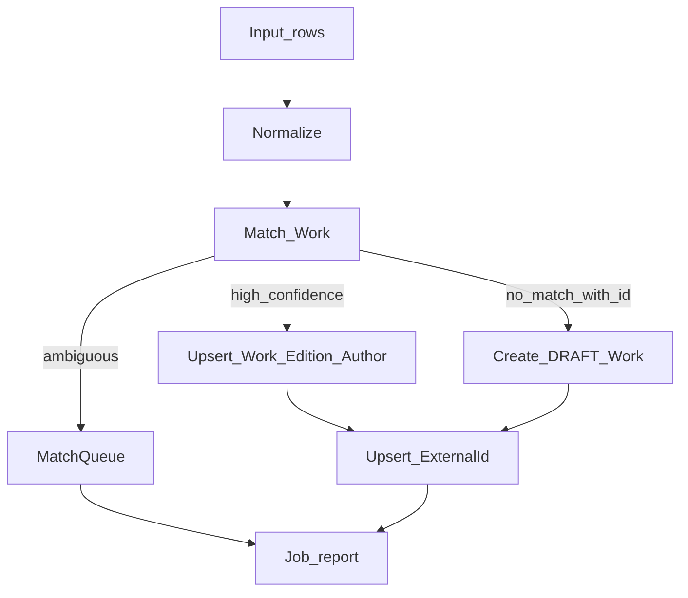

# Пайплайн импорта каталога

Связано: [database-schema](database-schema.md), [admin](admin.md). Jobs: BullMQ.

## Цель

Наполнять закрытый каталог из открытых источников без дублей. Неуверенные строки — в `MatchQueue`, батч не падает целиком.

## Источники MVP

| Источник | Что берём | Идентификаторы |
|----------|-----------|----------------|
| Open Library | works, authors, editions | `openlibrary` keys |
| Wikidata | произведения/авторы, RU/orig labels | `wikidata` Q-id |
| ISBN list / JSON upload (admin) | editions → work | isbn13, произвольные ExternalId |

Оба каталога (OL + Wikidata) пишут в одну модель `Work` через общий matching и `ExternalId`.

## Нормализация

1. Unicode NFKC, trim, схлопывание пробелов.
2. ISBN: цифры; ISBN10→ISBN13 при возможности.
3. `titleNorm` = lower(title) без пунктуации.
4. Год: int или null; язык издания: ISO 639-1.

## Порядок matching (Work)

1. Точное совпадение `ExternalId (source, externalKey)` — OL, Wikidata, isbn и др.
2. Совпадение ISBN13 на `Edition`.
3. Fuzzy: `titleNorm` + авторы + год ±1.
4. Опционально LLM-подсказка только если шаг 3 дал 1–3 слабых кандидата → предложение в очередь, не авто-merge при низкой уверенности.

## Исходы (зафиксировано)

| Ситуация | Действие |
|----------|----------|
| Совпал ISBN или ExternalId | Авто-привязка / upsert |
| Нет id, fuzzy **очень высокий** (≥ ~0.92 стартово) | Авто-привязка |
| Fuzzy средний (~0.75–0.92) | `MatchQueue`, без авто-привязки |
| Низкая похожесть, но есть OL/Wikidata/ISBN | Создать `Work` со `status=DRAFT` + ExternalId |
| Низкая похожесть, без id | Только `MatchQueue` |

Пороги 0.92 / 0.75 — стартовые, тюнятся без смены модели.

## Job `catalog.import.batch`

- Адаптеры: `OpenLibraryAdapter`, `WikidataAdapter`, `IsbnUploadAdapter`.
- Chunk + идемпотентность по `(source, externalKey)` или hash строки.
- После импорта опционально `catalog.dedup.scan` → кандидаты в admin UI (авто-merge только при конфликте unique ExternalId — не должно случаться).

## Upsert-правила

- Найден PUBLISHED Work → заполнять пустые поля; **не** затирать `titleRu` / `descriptionRu`, если `adminEditedAt` задан.
- Новый Work без хорошего RU title → лучший доступный label + при необходимости очередь на RU-именование.
- Authors/Series — тот же matching + ExternalId.

## Ошибки

- 429/5xx внешних API — retry BullMQ с backoff.
- Частичный успех батча ок; отчёт: created / updated / queued / failed / drafts.
- Одна UNMATCHED строка не роняет весь job.

## Отчёт для admin

Counts + ссылки на MatchQueue + BullMQ job id.
