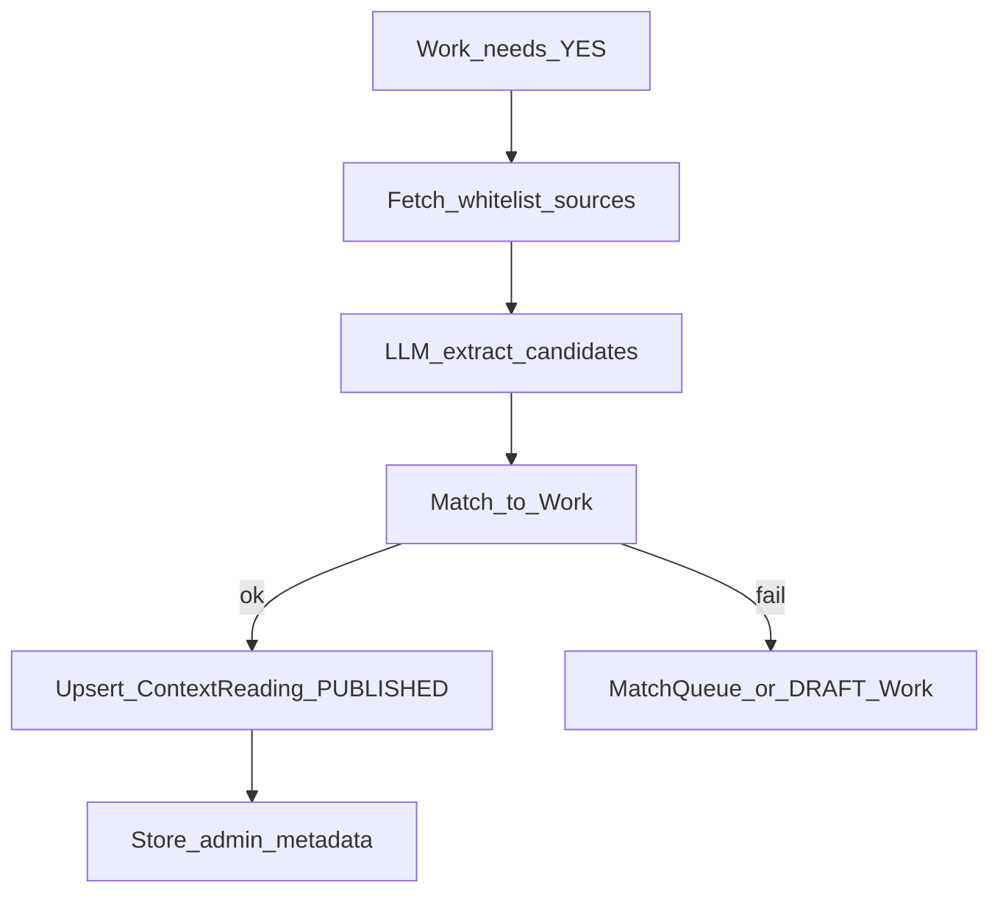

# LLM / ContextReading

Связано: [mvp-spec §7.4](../product/mvp-spec.md), [database-schema](database-schema.md), [admin](admin.md).

## Цель

Автоматически собрать блок «Для понимания» только для книг, которым он нужен: открытые источники → LLM → RU `whyText` → автопубликация. Источники пользователю не показываем.

## Решения этапа

- Решение **admin `needsContext` YES/NO важнее модели**; модель не переопределяет явный admin NO (и уважает YES как разрешение на extract).
- Источники только из **whitelist доменов** (постепенное наполнение в конфиге/админке); без произвольного краулинга всего интернета.
- После автопубликации — очередь выборочной правки (этап 4), без обязательного pre-moderation gate.

## Когда блок нужен (`Work.needsContext`)

| Значение | Смысл |
|----------|--------|
| `UNKNOWN` | ещё не классифицировали / низкая уверенность |
| `YES` | нужен блок / разрешён extract |
| `NO` | явно не нужен |

### Job `context.classify.need`

1. Если admin уже поставил YES или NO — **не перезаписывать** автоклассификацией.
2. Эвристики (плотный граф связей, тема классика/философия и т.п.) + OpenAI JSON: `{ needs_context, confidence, reason }`.
3. Высокая confidence → YES/NO; иначе UNKNOWN + сигнал админу.

## Whitelist источников

- Только одобренные домены/типы (энциклопедии, открытые академические материалы, лицензированные предисловия — по списку).
- Запрет: пиратские библиотеки, платный full-text как зеркало, длинная перепечатка эссе.
- Храним URL + короткий `sourceSnippet` (ориентир ≤ ~500 символов), не полное эссе.

## Job `context.extract.publish`



### Контракт LLM (JSON)

```json
{
  "candidates": [
    {
      "title": "string",
      "author": "string",
      "year": null,
      "importance_rank": 1,
      "why_text_ru": "1-2 предложения",
      "evidence_quote": "короткая выдержка или null"
    }
  ],
  "disclaimer_ok": true
}
```

Правила: `why_text_ru` только RU; не выдумывать книги без evidence; max N кандидатов (напр. 8); при `disclaimer_ok=false` или 0 matched — не публиковать пустой блок (DRAFT + review).

Matching — как import-pipeline. Повторный run не перетирает `REJECTED` без `force`.

## Пользовательский UI

- Секция только при ≥1 PUBLISHED.
- Сортировка `importanceRank` ASC; ссылка на Work + whyText.
- Дисклеймер об автосборке; **нет** URL / snippet / model.

## Риски

| Риск | Митигация |
|------|-----------|
| Галлюцинации | whitelist + evidence; reject; audit |
| Copyright | короткие snippet + URL |
| Мусор у всех книг | classify; admin NO; пустой блок не рендерится |
| Стоимость | classify до extract; кэш fetch |

## `LlmProvider`

Абстракция над OpenAI (`LLM_MODEL` в env); JSON complete для classify/extract.
