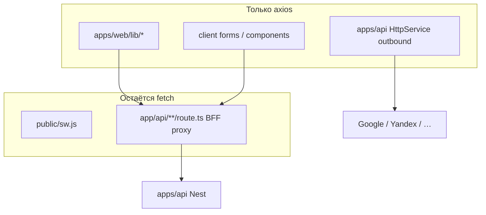
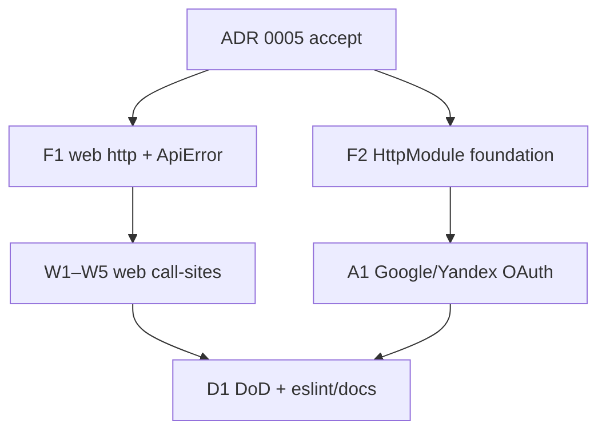

# План миграции: axios (web + api)

Связано: [ADR 0005](../adr/0005-axios-http-client.md) (**accepted**), [stack-and-architecture](stack-and-architecture.md), [agent-dev-flow](agent-dev-flow.md).

**Статус:** in progress — ADR accepted; эпик Beads **`bd-707`** (1/10 closed F0). В работе: `bd-707.2` (F1 web http). Сборочная: `feat/bookspace-bd-707`.

**Цель:** перевести весь **прикладной** HTTP в `apps/web` (lib + client) и `apps/api` (outbound) на axios; native `fetch` оставить только в Service Worker и Next BFF-proxy.

**Не в scope:** смена BFF-контракта, cookie/auth модели, OpenAPI; пакеты сверх согласованных в ADR — только после нового согласования.

---

## Принципы

1. **Foundation сначала** — web-клиент + `ApiError`; api `HttpModule` — затем call-sites.
2. **Полная миграция в эпике** — DoD = нет `fetch(` в запрещённых путях (см. ниже).
3. **No new legacy** — новый app HTTP только через согласованный стек (web: axios instance; api: `HttpService`).
4. **Исключения явны** — SW и BFF-proxy не мигрируем.
5. **Тесты** — unit на клиент/ошибки; существующие unit/e2e затронутых модулей зелёные перед merge. TDD по [agent-dev-flow](agent-dev-flow.md).
6. **Зависимости:** `axios` (web + api) + `@nestjs/axios` (api); shared `packages/http` — нет.

---

## Зависимости (после accept)

| Пакет | Workspace | Зачем | Лицензия |
|-------|-----------|--------|----------|
| `axios` | `apps/web` | App HTTP (lib + client) | MIT |
| `axios` | `apps/api` | peer / runtime для `@nestjs/axios` | MIT |
| `@nestjs/axios` | `apps/api` | `HttpModule` / `HttpService` для outbound | MIT |

Bundle: на web — один shared axios instance. На api RxJS уже в Nest; `firstValueFrom` — стандартный паттерн.

---

## Границы fetch vs axios

### Запрещённые пути для нового `fetch(` (DoD)

- `apps/web/lib/**`
- `apps/web/app/**/*.tsx` (и client-компоненты с data-fetching)
- `apps/api/src/**` (тесты мокают `HttpService`, не глобальный `fetch`)

### Разрешённые `fetch(`

- `apps/web/public/sw.js`
- `apps/web/app/api/**/route.ts`

Рекомендация на DoD: `eslint` `no-restricted-globals` / `no-restricted-syntax` с overrides на разрешённые пути (или `rg`-проверка в CI/задаче D1).

---

## Целевая архитектура клиентов

### Web — `apps/web/lib/http.ts`

- `axios.create({ baseURL` опционально, `withCredentials: true`, `timeout` })`.
- Response interceptor: при ошибке ответа → `ApiError` (`status`, `message` из body: `message` string | string[], fallback RU-текст).
- Экспорт: `api` (instance) и/или тонкие `apiGet` / `apiPost` при необходимости; предпочтительно instance + типы.
- Call-sites возвращают `response.data`, ловят `ApiError`.

### Api — `@nestjs/axios`

- Зарегистрировать `HttpModule.register({ timeout, … })` (например в `AppModule` или отдельном `HttpOutboundModule`, импортируемом auth/context).
- Outbound-клиенты (`GoogleOAuthClient`, `YandexOAuthClient`, …) инжектят `HttpService`.
- Вызовы: `firstValueFrom(this.http.post|get(...))`; при Axios error / non-2xx — доменные Nest-исключения (как сейчас при `!response.ok`).
- **Без** interceptor → web-`ApiError`.
- Не использовать «голый» `axios.create` в api app-коде вне конфигурации `HttpModule`.

---

## Порядок работ

---

## Карта задач

Эпик Beads: **`bd-707`**. Сборочная: `feat/bookspace-bd-707`.

### Foundation

| # | Issue | Задача | Содержание |
|---|-------|--------|------------|
| F0 | `bd-707.1` | ADR accept + deps | ADR → accepted; `pnpm add axios` в web и api; `pnpm add @nestjs/axios` в api; ссылки в docs |
| F1 | `bd-707.2` | Web http foundation | `lib/http.ts`, `ApiError`, interceptor, unit (2xx / 4xx message string / array / empty) |
| F2 | `bd-707.3` | Api HttpModule foundation | `HttpModule.register`, экспорт модуля для outbound; unit/smoke на инжект `HttpService`; без смены OAuth ещё |

### Web call-sites

| # | Issue | Задача | Файлы (ориентир) |
|---|-------|--------|------------------|
| W1 | `bd-707.4` | Auth lib | `apps/web/lib/auth.ts` |
| W2 | `bd-707.5` | Catalog lib | `catalog-*.ts`, `catalog-search.ts`, `catalog-context-reading.ts` |
| W3 | `bd-707.6` | Admin context lib | `apps/web/lib/admin-context.ts` |
| W4 | `bd-707.7` | Client forms | `add-library-item-form.tsx` и прочие прямые `fetch` в UI |
| W5 | `bd-707.8` | Регресс | unit затронутых lib + Playwright smoke auth/library/admin по наличию |

Можно объединять W1–W4 в 1–2 ветки, если объём мал; в плане держим разрезы для ревью.

### Api outbound

| # | Issue | Задача | Файлы |
|---|-------|--------|--------|
| A1 | `bd-707.9` | OAuth Google + Yandex | `google-oauth.client.ts`, `yandex-oauth.client.ts` → `HttpService` + unit/e2e |

### DoD

| # | Issue | Задача | Содержание |
|---|-------|--------|------------|
| D1 | `bd-707.10` | Вычистка + guardrails | `rg fetch(` = только исключения; eslint restrict; обновить docs; план → completed |

**Deps:** F1/F2 ← F0; W1–W4 ← F1; W5 ← W1–W4; A1 ← F2; D1 ← W5 + A1.

---

## Инвентарь call-sites (на старт)

| Зона | Путь | Действие |
|------|------|----------|
| Web lib | `lib/auth.ts`, `lib/catalog-*.ts`, `lib/admin-context.ts`, `lib/catalog-search.ts`, `lib/catalog-context-reading.ts` | → web axios |
| Web UI | `app/library/add-library-item-form.tsx` | → web axios |
| BFF | `app/api/auth|admin|me/[...path]/route.ts` | **оставить fetch** |
| SW | `public/sw.js` | **оставить fetch** |
| Api | `auth/google-oauth.client.ts`, `auth/yandex-oauth.client.ts` | → `HttpService` |

---

## Правила для задач

- Одна задача = foundation **или** группа call-sites **или** DoD.
- Prod-код после падающего теста на поведение клиента/ошибки (F1/F2) или на поведение модуля (W*/A1).
- Не трогать SW/BFF «заодно».
- Не добавлять shared `packages/http` / ky / ofetch без нового согласования.

## Проверки качества

- Unit: `ApiError` mapping; OAuth exchange/userinfo на mock `HttpService`.
- API e2e auth Google/Yandex (test mode) — зелёные.
- Web: существующие unit/smoke затронутых экранов.
- DoD: grep/eslint — нет лишнего `fetch(`.

## Критерии приёмки эпика

- [x] ADR 0005 **accepted**
- [x] `axios` в `apps/web` и `apps/api`; `@nestjs/axios` в `apps/api`
- [ ] Все строки инвентаря «→ …» мигрированы
- [ ] `fetch(` только в SW + BFF-proxy (и тест-хелперах при необходимости)
- [ ] Docs/stack обновлены; статус плана → completed
