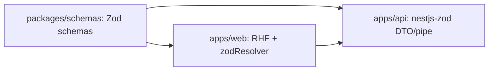

# План миграции: RHF + Zod (full contour)

Связано: [ADR 0004](../adr/0004-rhf-zod-full-contour.md), [stack-and-architecture](stack-and-architecture.md), [agent-dev-flow](agent-dev-flow.md).

**Цель:** перевести формы `apps/web` и валидацию DTO `apps/api` на единый стек RHF+Zod с общими схемами в `packages/schemas`, без big-bang и с конечным полным отказом от `class-validator`.

## Принципы

1. **Foundation before rollout**: сначала базовая инфраструктура в `packages/schemas`, web и api.
2. **On-touch migration**: переводить существующий код по доменам/страницам/endpoint-группам.
3. **No new legacy**: новый код сразу на RHF+Zod, без новых DTO на `class-validator`.
4. **Contract-first**: схема в `packages/schemas` первична; web и api импортируют её.
5. **Epic completion = 100% migration**: по завершении трека в runtime нет `class-validator`.

## Целевые зависимости

### Web (`apps/web`)

- `react-hook-form`
- `zod@v4`
- `@hookform/resolvers`

### Shared (`packages/schemas`)

- `zod@v4`

### API (`apps/api`)

- `zod@v4`
- `nestjs-zod`

## Архитектурный контур

## Этапы работ

### F1. Shared foundation (`packages/schemas`)

- Создать workspace-пакет `packages/schemas`.
- Зафиксировать структуру по доменам (например: `auth`, `search`, `admin/context`).
- Экспортировать:
  - input-схемы;
  - типы (`z.infer`);
  - договорённость по naming (`XxxInputSchema`, `XxxInput`).

### F2. Web foundation (`apps/web`)

- Подключить RHF + zod resolver.
- Зафиксировать `shadcn Form` как общий form-паттерн на базе текущих `components/ui`.
- Зафиксировать правила ошибок (field-level vs form-level).
- Разрешить friendly/localized mapping сообщений на web поверх той же схемы и `path/code` из API.
- Добавить smoke/unit примеры формы на новой обвязке.

### F3. API foundation (`apps/api`)

- Подключить `nestjs-zod`.
- Зафиксировать паттерн DTO/pipe для endpoint-валидации из shared-схем.
- Привести формат `400 validation errors` к единому JSON-контракту (`code`/`path`/`message`).
- OpenAPI — только через `nestjs-zod` (`createZodDto` + setup/`cleanupOpenApiDoc` библиотеки); свой генератор не вводим.

### M1. Первая волна on-touch (уже существующие зоны)

- `/login`
- `/register`
- `/search`
- `/admin/context`

Для каждой зоны: schema in shared -> web form/handler -> api endpoint DTO -> tests.

### M2. Доменная миграция по очереди

- Мигрировать остальные формы/DTO при касании соответствующих фич.
- Каждый шаг завершать зелёными тестами и без регресса контрактов.

### M3. Завершение эпика

- Удалить остатки `class-validator` и связанного legacy-кода.
- Убрать неиспользуемые DTO/утилиты старого подхода.
- Зафиксировать завершение трека в документации и quality gates.

## Правила для задач миграции

- Одна задача = один доменный срез (или конкретная страница + связанные endpoint-ы).
- Вертикаль обязательна: shared schema -> web -> api -> tests.
- Если миграция требует нового пакета сверх согласованных, остановиться и согласовать отдельно.

## Проверки качества

- `apps/web`: unit/smoke для мигрированных форм.
- `apps/api`: unit + integration для DTO/pipe в мигрированном домене.
- E2E web<->api для критичных пользовательских сценариев.

Критерий готовности этапа: нет regressions, новые сценарии используют RHF+Zod end-to-end.
