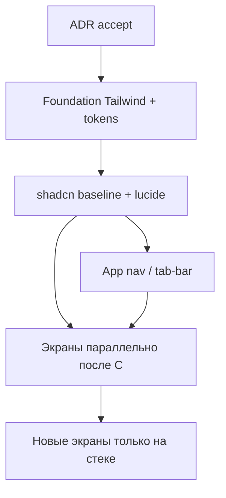

# План миграции: Tailwind + shadcn

Связано: [ADR 0003](../adr/0003-tailwind-shadcn.md) (**accepted**), [screens](screens.md), [stack-and-architecture](stack-and-architecture.md), [ui-ru](../../.cursor/rules/ui-ru.mdc).

**Цель:** перевести `apps/web` на Tailwind + shadcn/Radix + Lucide инкрементально, без big-bang и без смены визуального языка «читальня».

**Не в scope:** новые продуктовые экраны, которых ещё нет в коде (они пишутся сразу на стеке после foundation — см. карту задач).

---

## Принципы

1. **Foundation сначала** — Tailwind theme + baseline shadcn (`Button`, `Input`, `Label`, `Card` минимум), затем меню и экраны.
2. **Один экран = одна beads-задача** (см. ниже). Строка меню — отдельная задача.
3. **On touch:** при открытии задачи экрана удаляем/не расширяем локальные правила в `globals.css` для этого экрана; классы → Tailwind; контролы → `components/ui`.
4. **Визуал:** сохранить токены (`--background`, `--foreground`, `--muted`, `--border`, `--surface`, `--accent`, …); не уходить в purple/Material defaults shadcn без перекраски theme.
5. **Тесты:** unit на затронутые компоненты; Playwright smoke/e2e экрана — зелёные перед merge. TDD по [agent-dev-flow](agent-dev-flow.md).
6. **Зависимости:** только согласованный стек (ADR 0003); новые пакеты сверх списка — снова согласовать.

---

## Зависимости (согласовано)

| Пакет | Зачем |
|-------|--------|
| `tailwindcss`, `postcss`, `autoprefixer` | утилитарные стили |
| shadcn CLI → `components/ui` | готовые компоненты в репо |
| `@radix-ui/react-*` | ставятся с компонентами shadcn |
| `lucide-react` | иконки |
| `class-variance-authority`, `clsx`, `tailwind-merge` | варианты + `cn()` |

---

## Порядок работ

Экраны после baseline можно вести параллельно разными ветками; меню желательно раньше публичных страниц, чтобы shell уже был на стеке.

---

## Карта задач → экраны

Эпик Beads: **`bd-wus`**.

### Foundation (блокер всех UI-миграций)

| # | Issue | Задача | Содержание |
|---|-------|--------|------------|
| F1 | `bd-wus.1` | Tailwind + tokens | PostCSS/Tailwind в `apps/web`; theme из текущих CSS variables; `globals.css` — base + legacy |
| F2 | `bd-wus.2` | shadcn baseline | `components.json`, `lib/utils.ts` (`cn`), `components/ui` для Button/Input/Label/Card; Lucide; короткий story/smoke что theme «читальня» |

### Оболочка

| # | Issue | Задача | Путь / файлы |
|---|-------|--------|----------------|
| N1 | `bd-wus.3` | Строка меню (tab-bar) | `components/app-nav.tsx`, стили `.app-nav*` в `globals.css` |

> Продуктовая IA меню (Главная · Поиск · Профиль) уже в эпике PWA (`bd-6b7.4`). Задача N1 — **стилевой** перенос на Tailwind+shadcn/Lucide, не смена маршрутов.

### Существующие экраны (по одному issue)

| # | Issue | Экран | Путь |
|---|-------|-------|------|
| S1 | `bd-wus.4` | Главная | `/` |
| S2 | `bd-wus.5` | Вход | `/login` |
| S3 | `bd-wus.6` | Регистрация | `/register` |
| S4 | `bd-wus.7` | Ошибка auth | `/auth/error` |
| S5 | `bd-wus.8` | Поиск | `/search` (+ `catalog-search-form`) |
| S6 | `bd-wus.9` | Карточка произведения | `/books/[slug]` (+ секция ContextReading, spoiler UI на странице) |
| S7 | `bd-wus.10` | Автор | `/authors/[slug]` |
| S8 | `bd-wus.11` | Персонаж | `/characters/[slug]` |
| S9 | `bd-wus.12` | Мир | `/worlds/[slug]` |
| S10 | `bd-wus.13` | Локация | `/places/[slug]` |
| S11 | `bd-wus.14` | Публичный профиль | `/u/[slug]` |
| S12 | `bd-wus.15` | Библиотека (stub) | `/library` |
| S13 | `bd-wus.16` | Admin ContextReading | `/admin/context` |

`not-found` для сущностей — в той же задаче, что и страница сущности.

### Завершение трека

| # | Issue | Задача | Содержание |
|---|-------|--------|------------|
| C1 | `bd-wus.17` | Конвенция | Обновить `stack-and-architecture.md`, при необходимости `ui-ru.mdc`: новый UI только Tailwind+shadcn; после миграции экрана — вычистить мёртвые селекторы из `globals.css` |

Экраны из [screens.md](screens.md), которых ещё нет в коде (`/rankings`, `/collections`, `/series`, остальной `/admin/*`, settings…) — **не** заводятся задачами миграции: пишутся сразу на стеке после F2.

---

## DoD на задачу экрана / меню

- [ ] Разметка и стили экрана на Tailwind; интерактивные контролы из `components/ui` (или осознанный exception в notes issue).
- [ ] Иконки — Lucide, если нужны.
- [ ] Нет регрессии RU-копирайта и поведения (auth, spoiler, admin-only).
- [ ] Unit и/или Playwright по экрану зелёные.
- [ ] Удалены или не используются устаревшие CSS-блоки этого экрана в `globals.css`.
- [ ] Ветка `feature/bd-<id>/…` от `develop`, PR → `develop`.

---

## Риски

| Риск | Митигация |
|------|-----------|
| Два мира стилей долго | C1 + запрет новых правил в legacy без задачи миграции |
| shadcn default theme | Сразу перекрасить tokens под Bookspace в F1/F2 |
| Конфликт с `bd-6b7` (PWA shell) | N1 только визуал; продуктовые изменения меню — в PWA-эпике |
| Scope creep admin | S13 только существующий `/admin/context`; остальное admin — на стеке с нуля |

---

## Согласование

| Решение | Статус |
|---------|--------|
| Стек целиком (Tailwind + shadcn/Radix + Lucide + cva/clsx/tailwind-merge) | ✅ человек |
| Инкрементальная миграция + задача на экран + отдельно меню | ✅ человек |
| ADR 0003 `proposed` → `accepted` | ✅ accepted 2026-07-22 |
| Старт F1 / `bd-wus.1` (prod-зависимости + код) | ⬜ можно стартовать |
| Состав beads `bd-wus`.* (17 детей) | ✅ |
| Правила агента (`stack.mdc`, `ui-ru.mdc`, stack-and-architecture) | ✅ обновлены |
