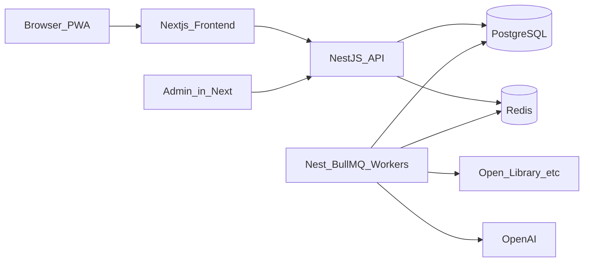

# Стек и архитектура (MVP)

Связано: [ADR 0001](../adr/0001-stack-mvp.md), [ADR 0003](../adr/0003-tailwind-shadcn.md) (UI-слой), [продуктовая спека](../product/mvp-spec.md), [миграция Tailwind + shadcn](migration-tailwind-shadcn.md).

## Решения

| Слой | Выбор | Notes |
|------|--------|--------|
| Frontend | Next.js (App Router) + TypeScript + React | Отдельное приложение; SSR/SEO публичных страниц; PWA |
| UI-kit | Tailwind CSS + shadcn/ui (Radix) + Lucide | **Канон** ([ADR 0003](../adr/0003-tailwind-shadcn.md) **accepted**): copy-in-repo `components/ui`; токены «читальня»; см. конвенцию ниже |
| Backend | NestJS + TypeScript | Отдельный API + workers |
| ORM / БД | Prisma + PostgreSQL | |
| Поиск | PostgreSQL Full-Text Search (русский конфиг) | Meilisearch — отдельный ADR при росте |
| Auth | На Nest (Passport / стратегии credentials + Google + Yandex); сессия или JWT в httpOnly cookie для Next | Вариант A: бэкенд — источник истины по identity |
| Jobs | BullMQ + Redis | Импорт, агрегация рейтингов, LLM |
| LLM | OpenAI API за абстракцией `LlmProvider` | Смена модели без переписывания пайплайнов |
| Админка | UI во фронте (`/admin`), данные через admin API Nest | Role check только на бэкенде; UI на том же kit |
| Деплой MVP | Local first (Docker Compose: Next, Nest, Postgres, Redis); cloud позже без привязки к вендору | |

## Переменные окружения

- Репозиторий содержит `.env.example` (корень, `apps/api`, `apps/web`) — шаблон для local dev.
- Файлы `.env` в git не попадают.
- **Prod:** никогда не копировать `.env.example` в prod как есть — только как шаблон с новыми значениями (БД, секреты auth, OAuth, LLM keys).

## Высокоуровневая схема



## Границы репозитория (ориентир)

Монорепо или два корня — на выбор при старте кода; логически:

```
apps/web/          # Next.js — UI, PWA, /admin pages
apps/api/          # NestJS — REST API, auth, BullMQ processors
packages/…         # опционально shared types / zod-схемы
docker-compose.yml # postgres, redis, api, web (dev)
```

Фронт **не** milкает в БД: только HTTP к Nest.

## UI-конвенция (apps/web)

Канон: [ADR 0003](../adr/0003-tailwind-shadcn.md) (**accepted**), план [migration-tailwind-shadcn.md](migration-tailwind-shadcn.md), правила [`stack.mdc`](../../.cursor/rules/stack.mdc) / [`ui-ru.mdc`](../../.cursor/rules/ui-ru.mdc).

| Правило | Смысл |
|---------|--------|
| Новый UI и новые экраны | Только **Tailwind** + примитивы `components/ui` (shadcn/Radix) + **Lucide** |
| Legacy `globals.css` | Допустим только для ещё не мигрированных экранов; **запрещено** добавлять новые селекторы/блоки под новые экраны или новый UI |
| On touch | При рефакторе экрана — перенос на стек ADR 0003 и вычистка мёртвых селекторов этого экрана из `globals.css` |
| Другой UI-kit | Только новый ADR + согласование зависимостей |

## Auth

- Роли: guest (нет сессии), `user`, `admin` (`User.role`).
- Провайдеры MVP: email+password, Google, Yandex.
- Nest выдаёт/валидирует сессию (предпочтительно httpOnly cookie на API-домене + CORS/credentials из Next; либо BFF-proxy в Next на `/api/*` → Nest, чтобы cookie была first-party).
- `isPremium` boolean в User без биллинга.
- Защита `/admin` UI — редирект на фронте; **обязательная** проверка role на Nest admin routes.

## Jobs (BullMQ)

| Очередь / job | Триггер | Результат |
|---------------|---------|-----------|
| `catalog.import.batch` | admin | Works/Editions/Authors + ExternalId |
| `rankings.import.source` | admin | ExternalRankingSource entries |
| `rankings.aggregate.publish` | admin / после импорта | AggregatedScore + Ranking |
| `context.classify.need` | admin / batch | needs_context на Work |
| `context.extract.publish` | admin / batch | ContextReading published + admin metadata |

Workers — отдельный Nest process или тот же app с `处理器` (в local compose — отдельный сервис `worker`).

## Языковая политика

- UI и канонические названия для пользователя — **ru**.
- Сырые поля источников — только admin API.
- Matching: ISBN / ExternalId → fuzzy → опционально LLM.

## Что не в MVP

- Микросервисы сверх `web` / `api` / `worker`.
- GraphQL (REST + OpenAPI достаточно).
- Meilisearch, биллинг, подписки/лента, интерактивный граф.
- Жёсткая привязка к Vercel/AWS в docs — cloud выбираем позже.
