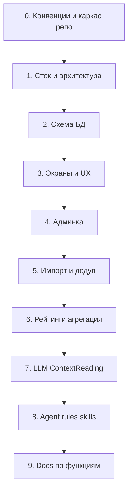

# Чеклист: документация и agent-setup Книжной вселенной

Продуктовая спецификация уже есть и утверждена. Код в репозитории ещё не начат. Дальше идём **строго по этапам**: на каждом шаге задаём уточняющие вопросы → пишем/кладём артефакты → подтверждаем → переходим дальше. Реализация кода — только после закрытия технического контура документации (или параллельно по явному решению).

**Конвенции по умолчанию** (можно скорректировать на этапе 0):
- Документация на **русском**, в папке `docs/`
- Продуктовая спека остаётся источником правды по «что»; техдок — по «как»
- Agent-настройка — под **Cursor** (`.cursor/rules`, skills, hooks при необходимости)

---

## Этап 0 — Каркас документации и конвенции

**Цель:** договориться о структуре репо и правилах документирования.

**Артефакты:**
- `README.md` — кратко о продукте + ссылки на docs
- `docs/README.md` — оглавление
- Перенос/ссылка на продуктовую спеку: `docs/product/mvp-spec.md` (из текущего plan-файла)

**Вопросы этапа:** язык docs (RU?), папка `docs/`, нужен ли ADR-стиль для решений.

---

## Этап 1 — Выбор стека и общая архитектура

**Цель:** зафиксировать runtime, фреймворк, БД, auth, очереди, LLM, хостинг — в одном tech-overview.

**Артефакт:** `docs/tech/stack-and-architecture.md`

**Темы для вопросов (идут первыми в диалоге):**
- Frontend: Next.js / другое; PWA-подход
- Backend: monolith API в том же app vs отдельный сервис
- БД: PostgreSQL (+ поиск: Postgres FTS / Meilisearch / etc.)
- Auth: email+password + Google + Яндекс (библиотека: Auth.js / Clerk / своё)
- Jobs: синхронно на старте vs очередь (Inngest / BullMQ / cloud jobs)
- LLM: провайдер и где крутятся пайплайны
- Админка: в том же приложении vs отдельный UI
- Хостинг / деплой MVP

---

## Этап 2 — Схема БД

**Цель:** превратить ER из спеки (§6) в конкретную схему таблиц, индексов, статусов, audit.

**Артефакт:** `docs/tech/database-schema.md` (+ опционально draft SQL/Prisma schema позже)

**Покрыть сущности:** Work, Edition, Author, Series, Character, World, Place, WorkRelation, ContextReading, ExternalId, Ranking/Collection (+ entries), ExternalRankingSource, AggregatedScore, User, UserBook, Note/Quote, Shelf/Tag, ReadingGoal; задел `is_premium`.

**Вопросы:** ORM, soft-delete, мультиязычные названия Work, черновики Work из LLM-очереди.

---

## Этап 3 — Экраны (карта UI)

**Цель:** полный список экранов guest/user/admin с навигацией и SEO.

**Артефакт:** `docs/tech/screens.md`

**Покрыть:** каталог (поиск, Work/Author/Series/Character/World), рейтинг/подборка, профиль/коллекция, кабинет (полки, цель), auth, spoiler gate, PWA shell.

---

## Этап 4 — Админка

**Артефакт:** `docs/tech/admin.md`

CRUD каталога, merge дублей, импорт, рейтинги/подборки, очереди ContextReading / unmatched, audit log.

---

## Этап 5 — Пайплайн импорта каталога

**Артефакт:** `docs/tech/import-pipeline.md`

Источники (Open Library и др.), нормализация, ExternalId, fuzzy match, очередь «не сматчено», идемпотентность.

---

## Этап 6 — Агрегация рейтингов

**Артефакт:** `docs/tech/rankings-aggregation.md`

Модель ExternalRankingSource → matching → AggregatedScore → автопубликация Ranking; формула/веса MVP; языковая политика (RU UI / сырьё в админке).

---

## Этап 7 — LLM / ContextReading

**Артефакт:** `docs/tech/llm-context-reading.md`

Отбор книг «нужен блок», whitelist источников, prompt-контракт, matching, автопубликация, risks/IP, observability (модель, URL, фрагмент в админке).

---

## Этап 8 — Правила, плагины, скиллы для агентов

**Цель:** агенты пишут код/docs в одном стиле со спекой.

**Артефакты (ориентир):**
- `.cursor/rules/` — продукт, стек, схема, RU UI, запреты (нет правок каталога user’ом и т.д.); TDD-флоу — `agent-dev-flow.mdc` → [docs/tech/agent-dev-flow.md](docs/tech/agent-dev-flow.md)
- Skills при необходимости (импорт, LLM-пайплайн, ADR)
- Опционально `AGENTS.md`

Сборка после этапов 1–7, чтобы правила ссылались на уже зафиксированный техдок.

---

## Этап 9 — Документация по каждой функциональности

**Цель:** feature-docs для приёмки и разработки (на базе §7 спеки).

**Артефакты** в `docs/features/` (по файлу на функцию):
- catalog-search-and-pages
- reading-order-and-relations
- context-reading-block
- user-library-and-profile
- notes-quotes-visibility
- reading-goal
- public-rankings
- public-collections
- recommendations
- auth
- admin-moderation
- pwa

Шаблон секций: цель → акторы → user flow → данные → API/jobs → края/ошибки → критерии приёмки → ссылки на tech.

---

## Порядок работы в чате

1. Закрываем **вопросы текущего этапа** (1–2 критичных за раз).
2. Пишем артефакты этапа.
3. Короткое подтверждение → следующий этап.
4. Код приложения — отдельный трек после этапов 1–7 (минимум стек + схема), если не решите иначе.

**Сейчас стартуем с этапа 0–1:** нужны ответы на вопросы про язык docs и предпочтения по стеку.
